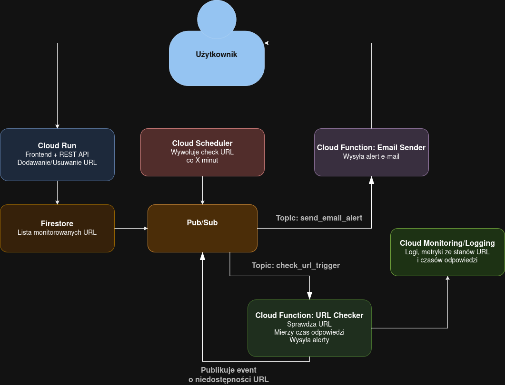

# Sprawdzanie Dostępności Stron

System monitorujący dostępność stron internetowych, zbudowany przy użyciu usług Google Cloud Platform

---

## Funkcjonalność
System cyklicznie sprawdza status wybranych adresów URL i wysyła powiadomienia w przypadku braku dostępu:
- automatyczne monitorowanie stron co określony interwał czasowy,
- asynchroniczne przetwarzanie z użyciem Pub/Sub,
- wysyłanie alertów e-mail,
- logi, metryki z dostępności stron i czasów oczekiwania na odpowiedzi,
- provisioning przy użyciu Terraform.

---

## Wykorzystane usługi
| Usługa | Rola w systemie |
|--------|------------------|
| **Cloud Run** | Frontend + API do zarządzania listą monitorowanych URL |
| **Firestore** | Przechowywanie URL |
| **Cloud Scheduler** | Regularne wyzwalanie procesu sprawdzania dostępności |
| **Pub/Sub** | Asynchroniczny przepływ eventów (sprawdź adresy, wyślij alert e-mail) |
| **Cloud Functions** | Worker sprawdzający dostępność + moduł wysyłania e-maili |
| **Cloud Monitoring** | Metryki (potencjalnie alerty na podstawie metryk)|
| **Cloud Logging** | Logi |
| **Terraform** | Automatyzacja Setup/Destroy|

## Diagram architektury

